## 2019 UK Road Accident Analysis

This project is an analysis of the accidents that happened in the UK in 2019. The dataset can be downloaded on the UK government website. The dataset can be downloaded [here](https://data.gov.uk/dataset/cb7ae6f0-4be6-4935-9277-47e5ce24a11f/road-safety-data)

Below are the steps taken:

1. Data preprocessing
2. Analysis and Visualization
3. Building predictive model
4. Recommendation

### Data preprocessing

The complete acccidents information is on three different csv files. One of the csv file contains the road accident record, the second csv file consists of casualty records and the third csv file consist information of vehicle involved in the accident.

Each of these files are loaded as dataframe i.e. accident, casualty and vehicle datafames. For accident datframe, some of the following columns are dropped due to too many of the cells having N/A as value.

- Location_Easting_OSGR
- Location_Northing_OSGR
- LSOA_of_Accident_Location
- Junction_Control
- 2nd_Road_Number
- 2nd_Road_Class
- 1st_Road_Number

The Location_Easting_OSGR, Location_Northing_OSGR and LSOA_of_Accident_Location are dropped because Longitutude and Latitude already capture the geographical location of the accident.

Some of the missing values are replaced using instinct,forward fill and mode.

### Analysis and Visualization

This analysis can be broken down into when, where and what caused the road traffic accidents.

#### When does road accident occur? 

Most of the road accidents happened towards and during the rush hours. Below is the density graph of the road accidents.

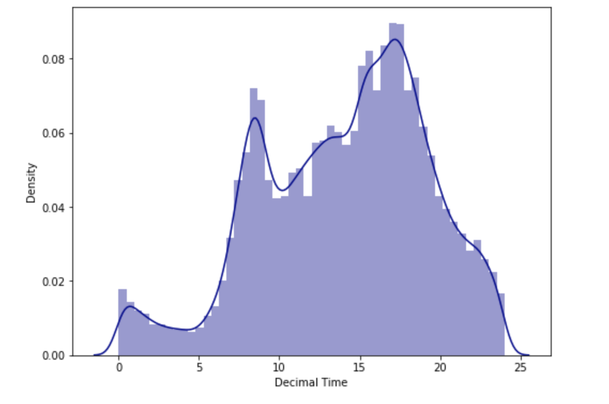

It is also noticeable that majority of the accidents happened during work days i.e. Monday to Friday. 

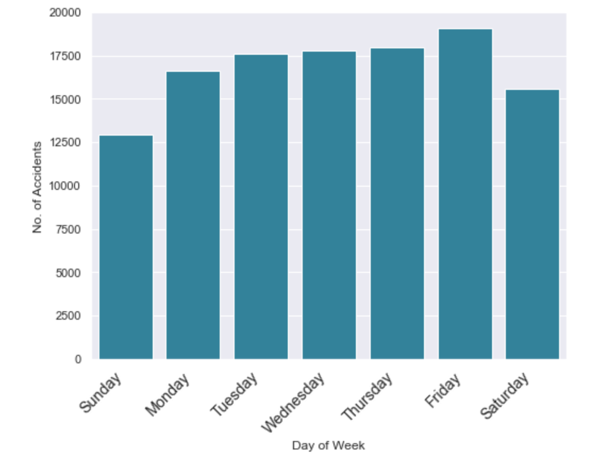

#### Where can accident occur?

The majority of the accidents happened in the urban region of the United Kingdom. Below bar chart shows that a very high percentage of the accidents are recorded in the urban region

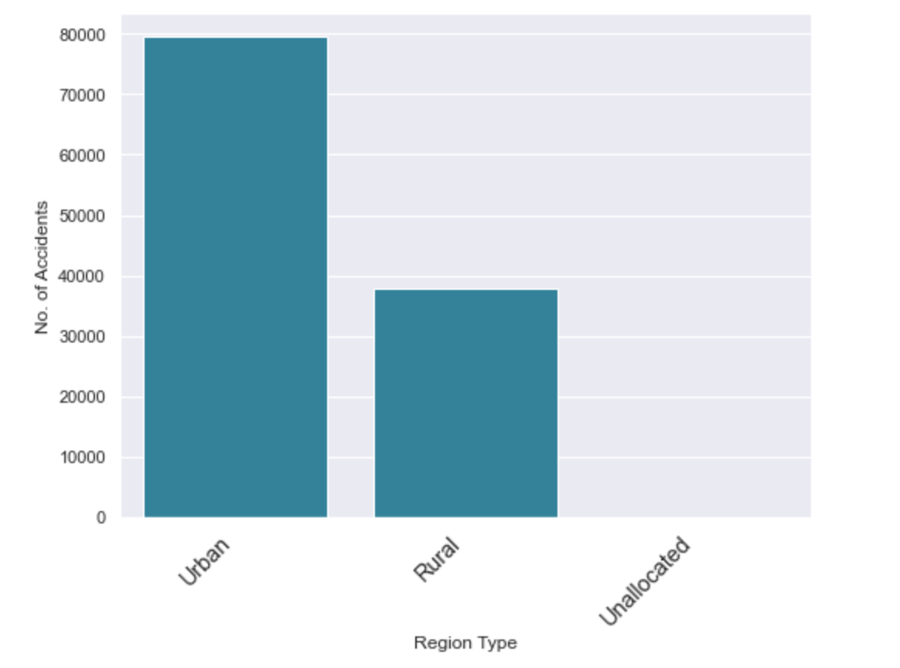

Futhermore, majority of the accidents happened in the south east part of the United Kingdom and the least number of accidents was recorded in the northern region.

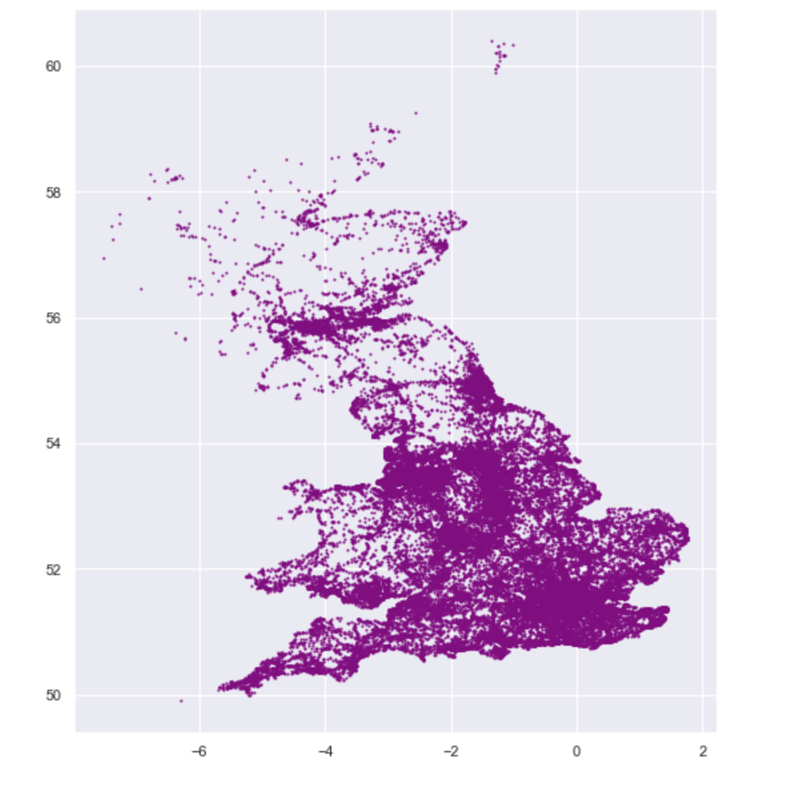

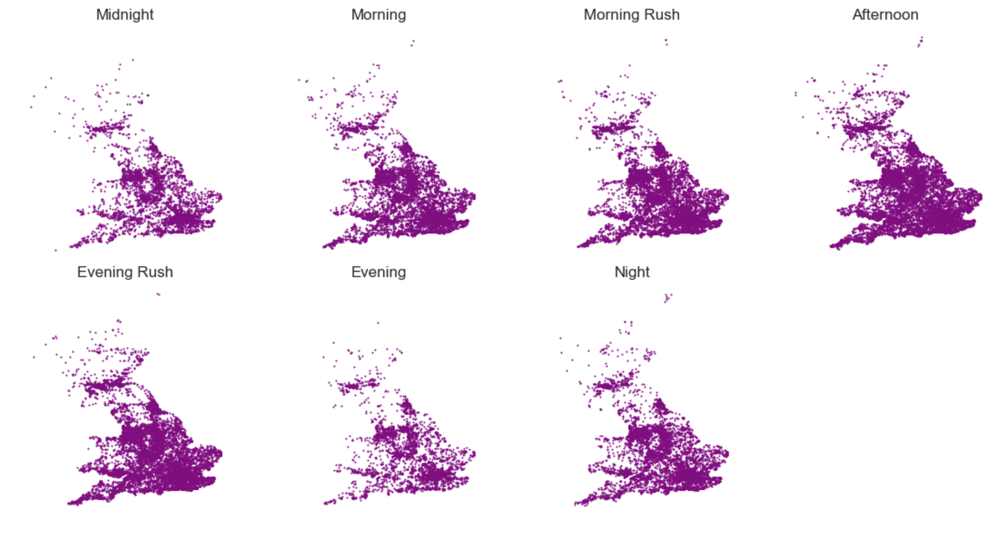

#### Under what conditions can accident occur?

There are several conditions under which road traffic accidents can occur. One of the condition is the vehicle speed limit. Majority of the accidents recorded happened on 30Km/hr speed limit. Below is the frequency plot of the road accidents based on speed limit.

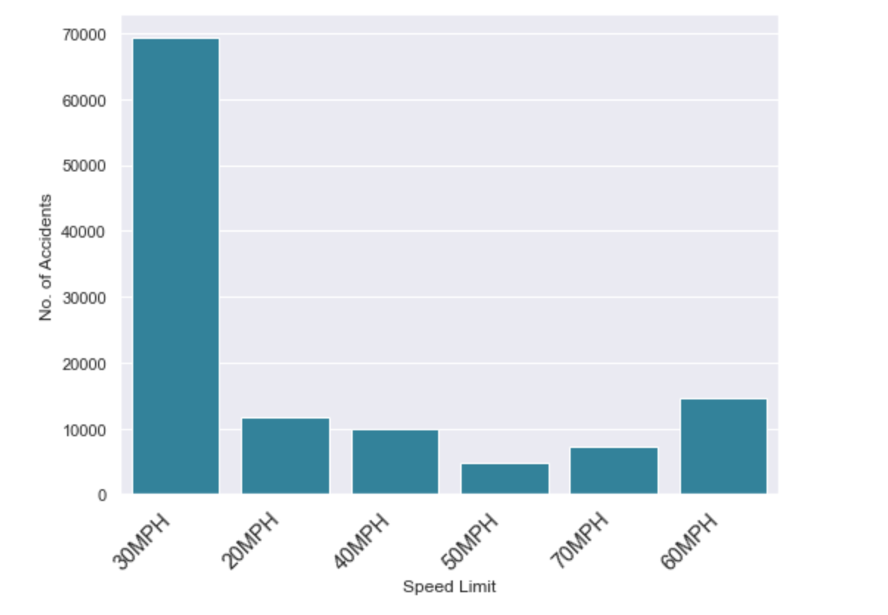

The majority of the accidents that happened under 30Km/hr speed limit happened in the urban region.

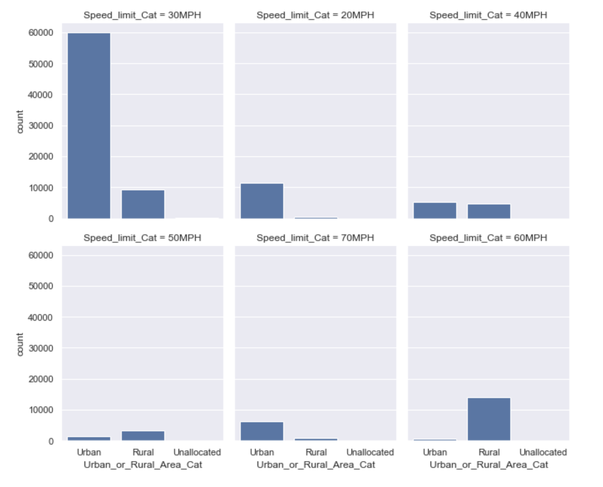

Furthermore, the majority of the accidents happened at the area where there are no pedestrian crossing control facility within 50 metres. Below is the accident frequency plot based on pedestrian crossing control facility.

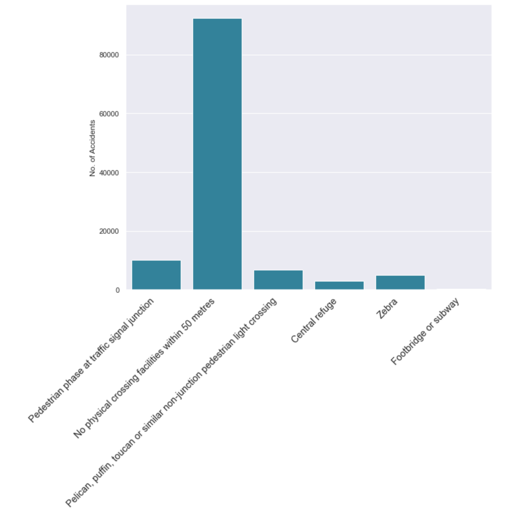

In addition, majority of the accidents happened under fine and less wind weather condition. Very few accidents are recorded when it's snowy or foggy.

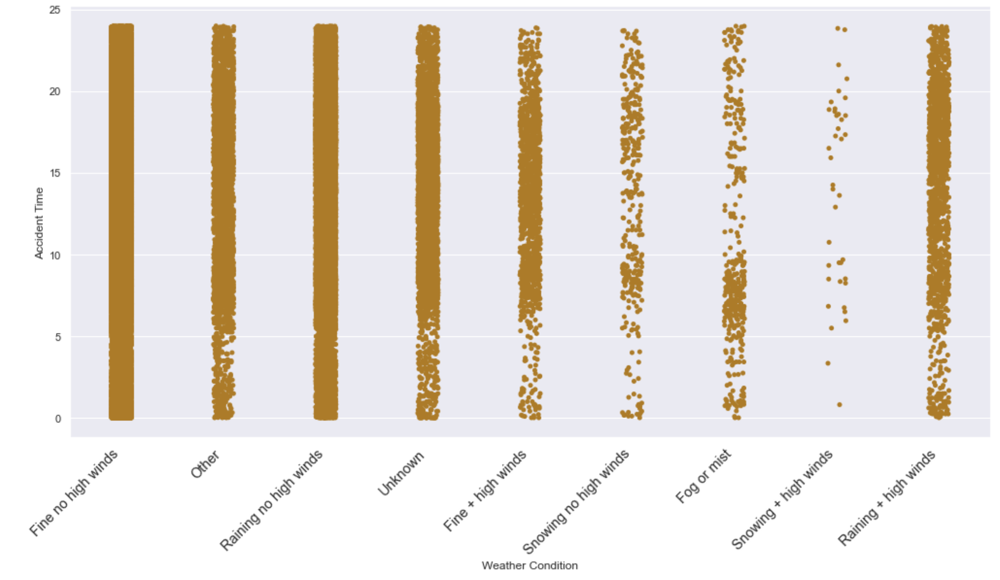

Lastly, most of the road accidents also happen while vehicles are on single carriageways. This can be seen below.

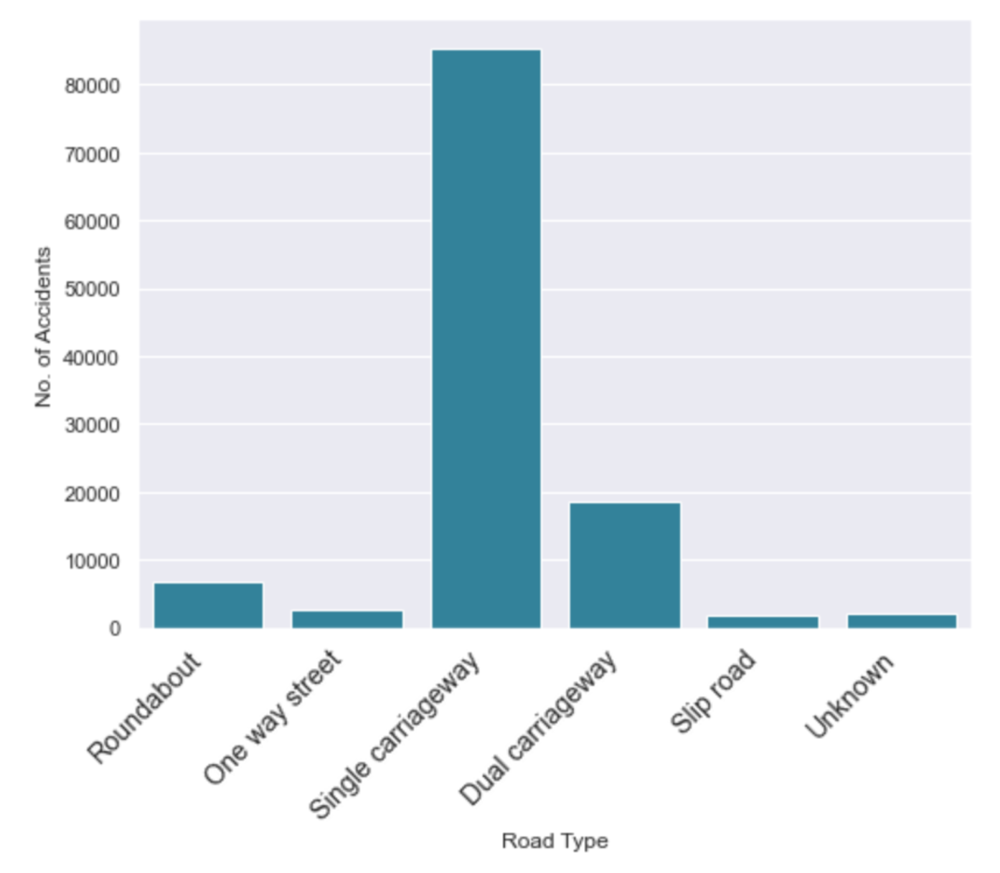

The notebook contains the detailed visualization.

### Building predictive model

Before building model, feature engineering was performed on the dataset and cleaned. Also, SelectKBest of sklearn library was used to select the features to use to train the model.

Below is the feature ranking with selectkBest.

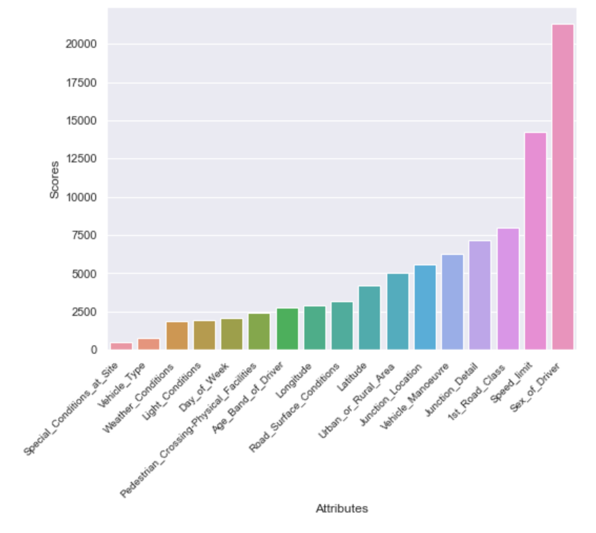

RandomForest was used to train the model and the validation accuracy was approximately 86%.

The details of this model can be found in the notebook.

### Recommendation

In order to reduce road accidents and increase safety in the United Kingdom, the following are recommend.

- Government should reduce the speed limit especially in the urban region on road where it is currently 30MPH. The speed limit should be reduced from 30MPH to maybe 25MPH or 20MPH in urban region

- Government should encourage construction of double carriageways in the future, especially in the urban region. 

- A large percentage of the road accidents are car accidents. Hence, Government should encourage car owners to board tram and public buses/coaches as well as invest more in tram and coaches/buses as this will drastically reduce road accidents caused by car

- Government should provide more physical crossing facilities as this will drastically reduce pedestrian road accidents.